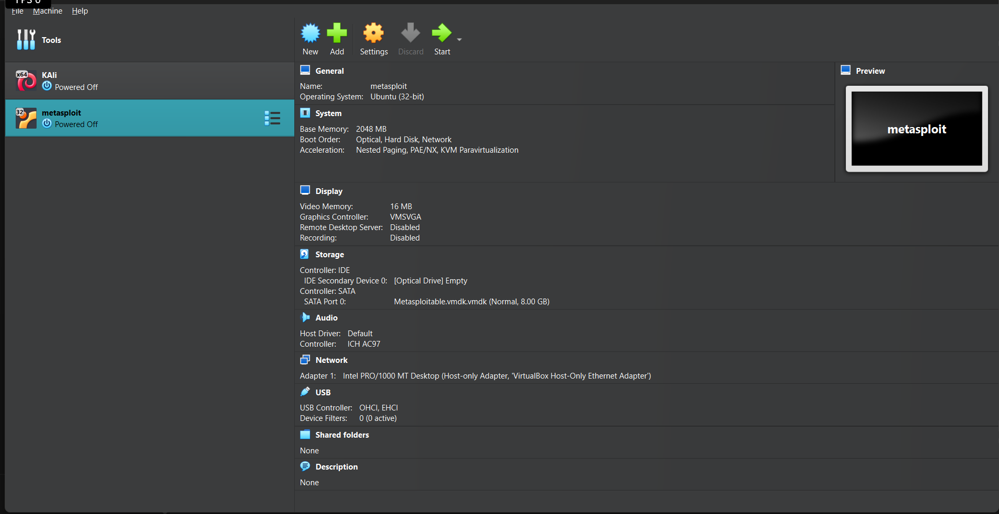
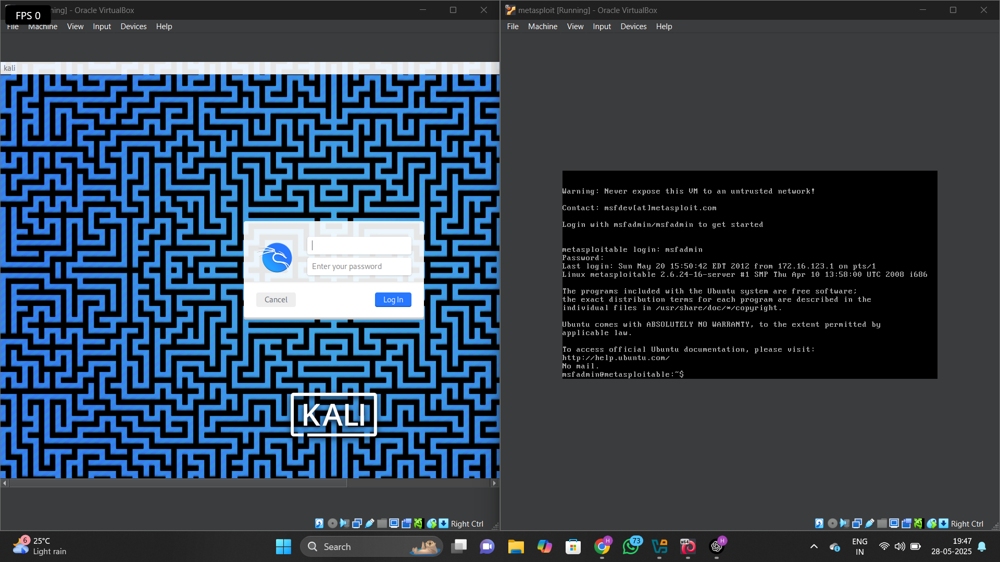

# 🔐 Cybersecurity Home Lab Setup

This repository documents the setup of my personal cybersecurity home lab designed to practice real-world penetration testing techniques.

---

## 🧰 Tools & Platforms Used

- **Kali Linux** (Attacker OS)
- **DVWA** - Damn Vulnerable Web Application
- **OWASP Juice Shop** (via Docker)
- **Metasploitable2** (Vulnerable VM)
- **VirtualBox** (VM management)
- **Docker** (for containerized Juice Shop)

---

## 🛠️ System Requirements

- OS: Kali Linux (VM or host)
- Virtualization: VirtualBox/VMware
- RAM: Minimum 6–8 GB recommended
- Disk: 50+ GB free space

---

## ⚙️ Installation Steps

### 1. Install DVWA
```bash
sudo apt update
sudo apt install dvwa -y
```
#### Configure database and Apache:
* Link DVWA to /var/www/html
* Setup DB via setup.php
* Login: admin / password

---

### 2. Set Up OWASP Juice Shop
```
sudo apt install docker.io -y
sudo docker pull bkimminich/juice-shop
sudo docker run -d -p 3000:3000 bkimminich/juice-shop
```
Access at: http://localhost:3000

---

### 3. Run Metasploitable2
* Imported into VirtualBox from .ova
* Network set to Bridged/NAT for access

---

### 4.Vulnerability Testing
#### I will begin testing:

* SQL Injection
* Command Injection
* XSS (Reflected/Stored)
* File Inclusion
* Authentication Bypass

---

### 📂Resources
* DVWA GitHub - https://github.com/digininja/DVWA
* Juice Shop GitHub - https://github.com/juice-shop/juice-shop
* Metasploitable2 VM - https://sourceforge.net/projects/metasploitable/

---

### Images
#### VMs


#### kali & Metasploitable2

